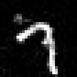
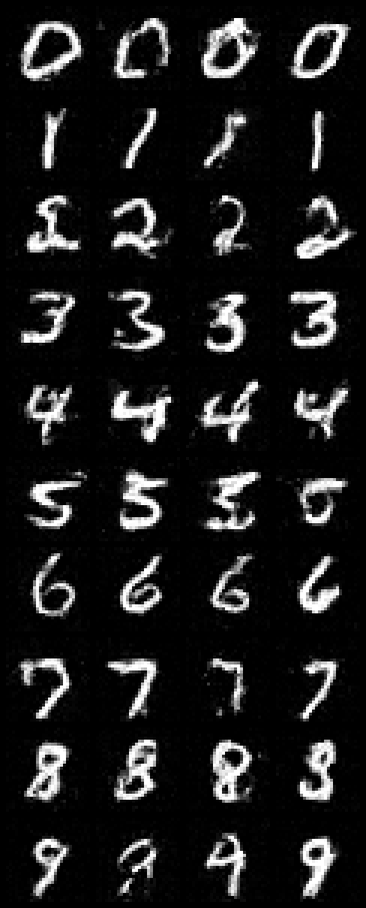

# tiny-transformer

A compact multimodal Transformer trained from scratch to perform both:

- `image -> <digit:N>` recognition
- `<digit:N> + random noise -> image` generation

The reverse path uses a conditional **Shortcut Model**, not a deterministic
pixel decoder. It is trained to support one-step generation while retaining
the option to sample with 2, 4, 8, ..., 128 steps from the same checkpoint.

This is an educational architecture. It borrows selected ideas from Gemma 4,
Qwen3.8-Next, and Shortcut Models, but it is not checkpoint-compatible with
those projects.

## What changed from the deterministic baseline

The original reverse path started with 49 learned blank patch queries and
predicted one canonical image for each digit. This version starts with random
Gaussian image noise. Consequently, different random seeds can produce
different handwriting for the same digit token.

## Architecture

The default model has 3 million trainable parameters.

### Shared representation

- Exactly ten learned digit embeddings: `<digit:0>` through `<digit:9>`.
- MNIST is split into a 7x7 grid of non-overlapping 4x4 raw-pixel patches.
- A single `16 -> 192` projection embeds each raw patch directly.
- Fixed 2D row/column sine-cosine coordinates preserve spatial location.
- Learned type/task embeddings distinguish recognition and generation.
- One Transformer backbone handles both directions.

For recognition, the final query vector is scored against the same digit
embedding matrix used for generation conditioning. This tied classifier keeps
image summaries and digit tokens in a common semantic space.

### Gemma 4-inspired details

- Encoder-free raw image-patch projection.
- Coordinate embeddings followed by input LayerNorm.
- Decoder-style shared Transformer.
- Pre- and post-RMSNorm around attention and MLP updates.
- QK normalization.
- Five local-attention layers followed by one global layer.
- Full RoPE with base 10k locally.
- Partial 25% RoPE with base 1M globally.
- Global attention reuses key content as value content.

The flow route uses bidirectional spatial attention because every image patch
needs the complete noisy image. Local spatial layers always expose the leading
condition token to every patch; global layers are fully connected. Recognition
keeps a causal mask, with its final query able to summarize all image patches.

### Qwen-inspired details

- Zero-centered RMSNorm parameters.
- Low-rank sigmoid gates on normalized residual updates.
- Gated GELU feed-forward layers.

Large-model features that do not help a 50-token MNIST sequence—MoE, sparse
attention, Gated DeltaNet, multi-token draft heads, and very large embedding
tables—are intentionally omitted.

## Shortcut objective

MNIST pixels are normalized to `[-1, 1]`. For a clean image `x1`, Gaussian
noise `x0`, digit label `y`, and time `t`, the optimal-transport path is:

```text
xt = (1 - t) * x0 + t * x1
velocity = x1 - x0
```

The implementation includes the paper's tiny terminal noise coefficient for
numerical stability.

There are eight condition levels with the default 128-step base grid:

| Level | Meaning |
| ---: | --- |
| 0 | requested step size `d=1` (one-pass generation) |
| 1 | `d=1/2` |
| 2 | `d=1/4` |
| ... | ... |
| 6 | `d=1/64` |
| 7 | infinitesimal/base flow-matching mode |

Every training batch contains two kinds of generation targets:

1. **Flow targets (75% by default).** Train level 7 directly against the
   empirical `x1-x0` velocity.
2. **Bootstrap targets (25% by default).** Query the EMA model for two
   half-sized steps, average their velocities, and train one twice-as-large
   step to match that stopped target.

For example, two `d=1/2` predictions supervise one `d=1` prediction. This
binary self-consistency propagates the grounded small-step behavior up to the
one-step route without a separate teacher-training phase.

The total objective is:

```text
loss = classification_weight * cross_entropy(image_to_digit)
     + generation_weight * mse(predicted_shortcut, target_shortcut)
```

There is no BCE reconstruction loss and no expensive generated-image cycle
inside the training loop. EMA weights generate bootstrap targets and are the
default weights used for inference.

## Installation

Python 3.10 or newer is recommended.

## Train

From this directory:

```bash
uv run train.py
```

Defaults:

- MNIST 60,000-image training split downloaded through torchvision.
- Deterministic 55,000/5,000 train/validation split.
- Batch size 256.
- 40 epochs.
- AdamW with matrix weight decay, warmup, cosine decay, and gradient clipping.
- CUDA BF16 when supported; otherwise CUDA FP16 with gradient scaling.
- 25% bootstrap examples and EMA decay 0.999.

A small smoke run is useful before committing to the full job:

```bash
uv run train.py --base-steps 16 --ema-decay 0.995 --classification-weight 0.25 --generation-weight 1.0 --epochs 50 --output-dir runs/mnist_shortcut16
```

Training writes:

- `runs/mnist_shortcut16/last.pt`
- `runs/mnist_shortcut16/best.pt`
- one-step sample grids after each epoch
- the exact run configuration

`best.pt` prioritizes one-step conditional digit accuracy, using validation
loss as the tie breaker. Both online and EMA weights are saved.

## Generate a digit

```bash
uv run infer.py --checkpoint runs/mnist_shortcut16/last.pt generate --token 7 --output generated_digit_7.jpg --seed 42
```



Change `--seed` to obtain different handwriting. Compare one-step and
few-step output by changing `--steps` to a power of two:

## Classify an image

```bash
uv run infer.py --checkpoint runs/mnist_shortcut16/last.pt classify --image generated_digit_7.jpg
```
White-background images are automatically inverted into MNIST's light-on-dark
convention. Use `--invert yes` or `--invert no` to override the heuristic.

Output:
```bash
prediction=7 token=<digit:7> top3=[7=100.00%, 9=0.00%, 2=0.00%]
```

## Generate all digits

```bash
uv run infer.py \
  --checkpoint runs/mnist_shortcut16/best.pt \
  grid \
  --steps 1 \
  --samples-per-digit 4 \
  --seed 123 \
  --output all_digits.png
```
Output:



Each row contains samples conditioned on one digit token.


## Tests

```bash
pytest -q
```

The tests cover patch round-tripping, both modality routes, gradient flow,
attention masks, tied digit embeddings, Shortcut target construction, and the
guarantee that `num_steps=1` invokes the velocity network exactly once.

## Practical expectations

For MNIST, pixel-space flow is appropriate. Larger natural images would
usually use a learned image latent space instead of transporting raw pixels.

## References

- Gemma 4 Technical Report: https://arxiv.org/abs/2607.02770
- One Step Diffusion via Shortcut Models: https://arxiv.org/abs/2410.12557
- Flow Matching for Generative Modeling: https://arxiv.org/abs/2210.02747
- Qwen3.8-Next Technical Report: https://arxiv.org/abs/2608.30320
